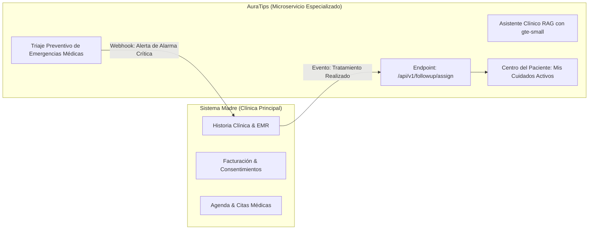

# 🔌 Contrato de Integración: AuraTips con el Sistema Madre de la Clínica

Este documento define las especificaciones técnicas y el contrato de interfaz para la **integración final entre el Sistema Madre de la Clínica (EMR / CRM)** y **AuraTips** (Microservicio de Acompañamiento Post-Tratamiento).

---

## 🏛️ Filosofía Arquitectónica y Desacoplamiento



### Principios Clave:
1. **No duplicidad:** El microservicio AuraTips no gestiona historias clínicas legales completas ni pasarelas de pago; su única responsabilidad es maximizar la adherencia al cuidado y la seguridad post-procedimiento.
2. **Identidad federada:** El sistema madre comunica al paciente vía un identificador externo (`external_id`), correo o teléfono, sin requerir re-registro manual.
3. **Canal bidireccional:** AuraTips recibe altas de tratamiento y devuelve al sistema madre métricas de adherencia diaria y alertas de urgencia médica en tiempo real.

---

## 🔐 Seguridad y Autenticación

Todas las solicitudes máquina a máquina (M2M) entre el sistema madre y AuraTips deben incluir un token secreto de servicio en la cabecera HTTP:

```http
Authorization: Bearer <AURATIPS_SERVICE_SECRET>
Content-Type: application/json
```

---

## 📡 Endpoints del Contrato

### 1. Alta y Asignación de Procedimiento al Paciente

Permite al sistema madre activar el seguimiento post-procedimiento inmediatamente después de que la **Dra. Mariana Gómez** finaliza la aplicación en cabina.

* **Método:** `POST`
* **Ruta:** `/api/v1/followup/assign`
* **Headers:**
  * `Authorization: Bearer <AURATIPS_SERVICE_SECRET>`
  * `Content-Type: application/json`

#### Payload de Entrada (`request body`):

```json
{
  "patient": {
    "external_id": "emr-pac-84920",
    "full_name": "Ana Gómez",
    "email": "ana.gomez@ejemplo.com",
    "phone": "+573001234567"
  },
  "procedure": {
    "slug": "toxina-botulinica-botox-facial",
    "application_date": "2026-09-22T14:30:00Z",
    "doctor_name": "Dra. Mariana Gómez",
    "clinic_location": "Sede El Poblado - Consultorio 402",
    "batch_number": "BTX-2026-09A",
    "treatment_notes": "Aplicación de 50 UI en tercio superior facial."
  },
  "initial_day": 0,
  "generate_access_link": true
}
```

#### Respuesta Exitosa (`201 Created`):

```json
{
  "success": true,
  "followup_id": "fol_93b2a8d1-7c4e",
  "patient_id": "eb1f24fb-a432-4881-b703-a921e95892b6",
  "procedure_title": "Toxina Botulínica Facial Integral",
  "current_day": 0,
  "phase_tag": "Día 0",
  "access_url": "https://auratips.aestheticacare.com/dashboard/learning?token=eyJh...jwt",
  "whatsapp_welcome_message": "Hola Ana, la Dra. Mariana Gómez ha activado tu protocolo de recuperación en AuraTips. Accede a tus cuidados de hoy aquí: https://auratips.aestheticacare.com/..."
}
```

---

### 2. Consulta de Estado y Adherencia del Paciente

Permite al médico revisar en su software principal cómo va la recuperación del paciente antes de la cita de revisión de los 14 días.

* **Método:** `GET`
* **Ruta:** `/api/v1/followup/status/:externalPatientId`
* **Headers:** `Authorization: Bearer <AURATIPS_SERVICE_SECRET>`

#### Respuesta Exitosa (`200 OK`):

```json
{
  "external_id": "emr-pac-84920",
  "patient_name": "Ana Gómez",
  "procedure_slug": "toxina-botulinica-botox-facial",
  "doctor_name": "Dra. Mariana Gómez",
  "current_day": 2,
  "checklist_compliance_rate": "100%",
  "checklist_history": [
    { "day": 0, "completed": 3, "total": 3 },
    { "day": 1, "completed": 4, "total": 4 },
    { "day": 2, "completed": 2, "total": 3 }
  ],
  "emergency_alerts_triggered": 0,
  "chat_queries_count": 4,
  "last_query": "¿Es normal tener ligera inflamación hoy?",
  "next_clinical_control_date": "2026-10-06"
}
```

---

### 3. Webhook de Notificación de Urgencia (AuraTips → Sistema Madre)

Si el paciente escribe en AuraTips un síntoma que activa el triaje crítico (ej: sospecha de isquemia vascular, necrosis o dolor desproporcionado), AuraTips emite inmediatamente un webhook HTTP POST al sistema madre de la clínica:

* **Método:** `POST`
* **URL:** Configurada en el sistema madre (`https://emr.clinicaprincipal.com/api/webhooks/auratips-alert`)
* **Headers:** `X-Auratips-Signature: sha256=...`

#### Payload emitido (`webhook body`):

```json
{
  "event": "patient.emergency_alert_triggered",
  "timestamp": "2026-09-22T17:15:30Z",
  "patient": {
    "external_id": "emr-pac-84920",
    "full_name": "Ana Gómez",
    "phone": "+573001234567"
  },
  "procedure": "Relleno y Perfilado de Labios con Ácido Hialurónico",
  "doctor": "Dra. Mariana Gómez",
  "urgency_level": "CRITICAL_ISCHEMIA_SUSPECTED",
  "user_message": "Tengo la piel blanca, fría y siento dolor punzante en el labio superior",
  "automated_actions_taken": [
    "Instrucción de suspender frío o masajes emitida al paciente",
    "Botón directo de WhatsApp hacia Dra. Mariana Gómez presentado",
    "Alerta prioritaria transmitida al sistema madre"
  ]
}
```

---

## 🛠️ Plan de Implementación de la Integración (Fase Final)

1. **Creación de Endpoint Handler:** `app/api/v1/followup/assign/route.ts` con validación de schema Zod y verificación de API Secret.
2. **Módulo de Webhook Emitter:** `lib/integration/webhook-emitter.ts` con reintentos exponenciales y firma criptográfica HMAC-SHA256.
3. **Generación de Enlaces Temporales:** Emisión de JWT / magic-links para que el paciente acceda desde WhatsApp directamente a su panel sin teclear contraseñas.
